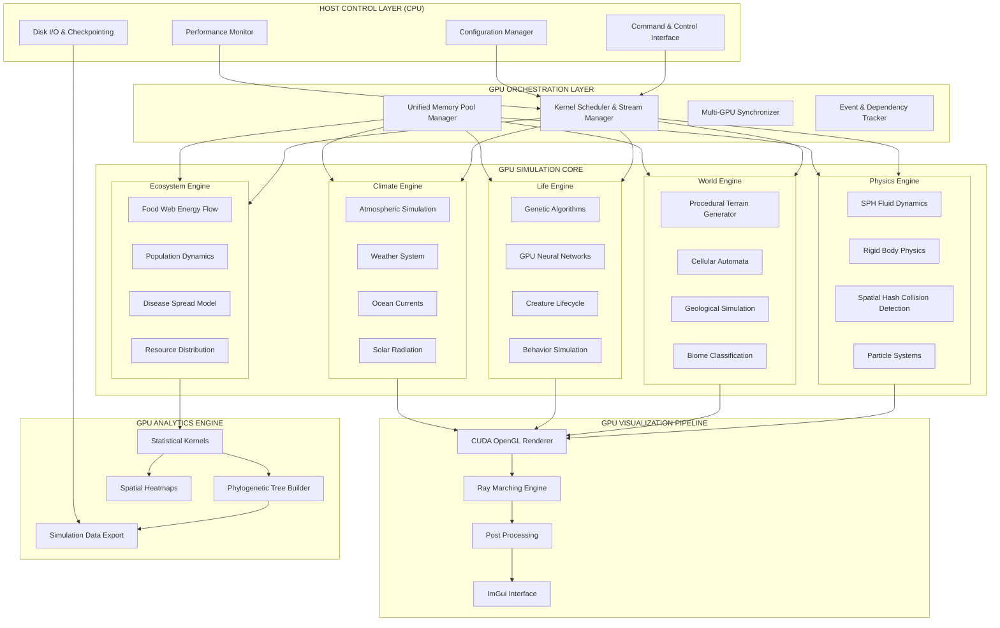
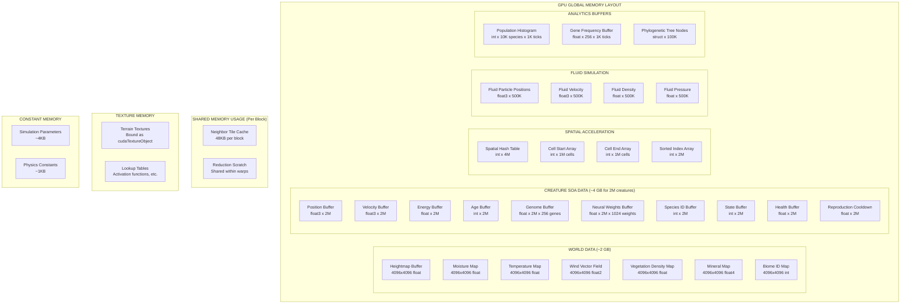
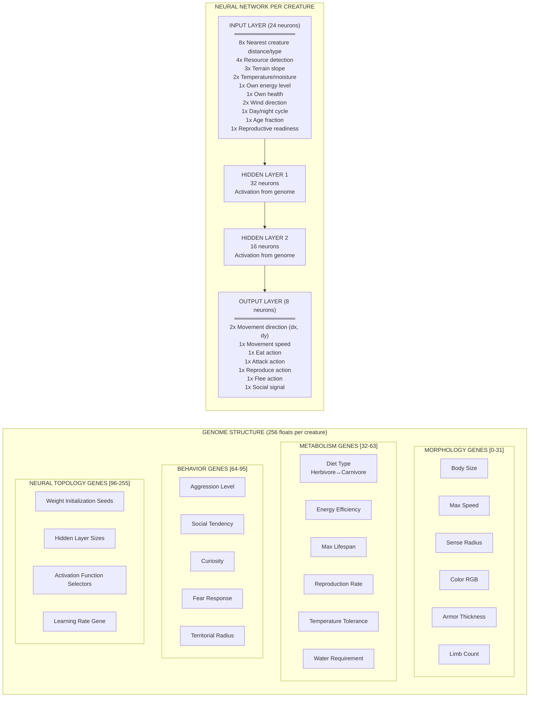
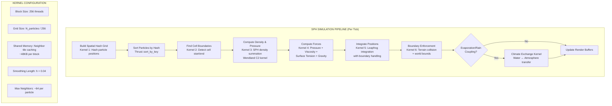
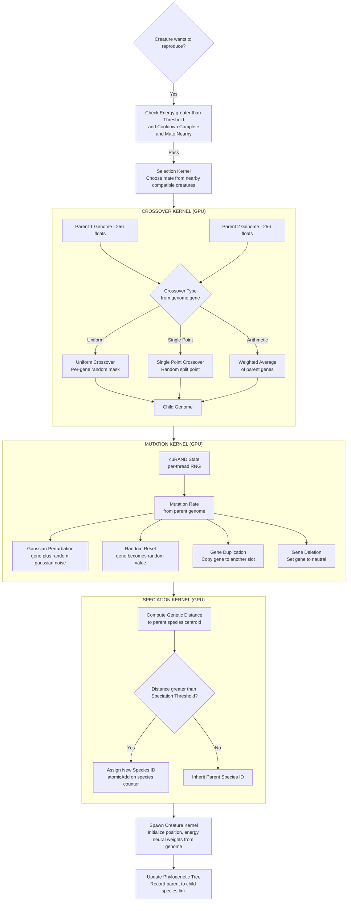
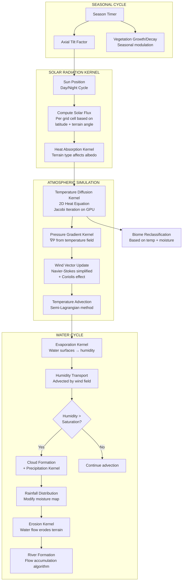
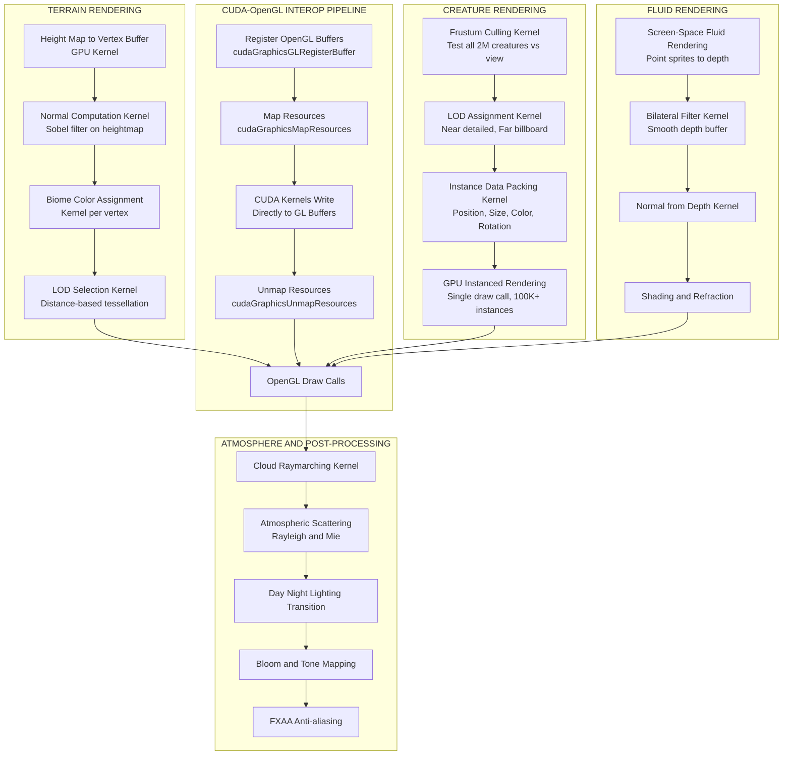
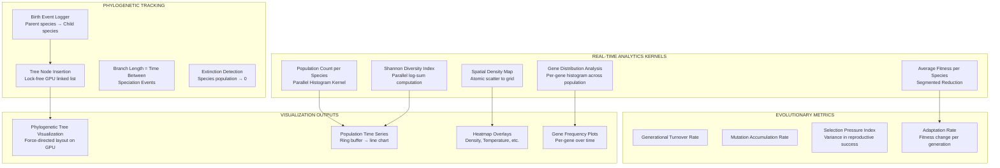
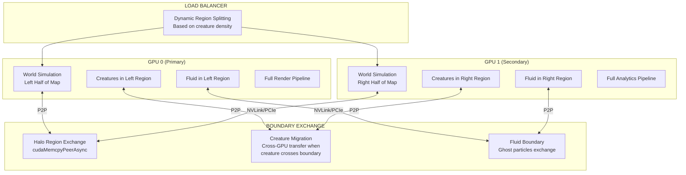

# GENESIS: GPU-Accelerated Planetary Evolution & Ecosystem Simulator


**GENESIS** is a massive-scale artificial life and planetary simulator written entirely in **C++ and CUDA**. By offloading 100% of the computational workload to the GPU, GENESIS eliminates CPU-GPU memory bottlenecks, allowing for the real-time simulation of millions of interacting creatures, dynamic climate patterns, fluid dynamics, and genetic evolution.

## Technical Highlights

* **Custom Neural AI Engine:** Every creature possesses a unique neural network. Feed-forward evaluation is executed in parallel via custom Batched GEMM CUDA kernels, with weights dynamically decoded from organism genomes directly in VRAM.
* **Genetic Algorithms:** Organism traits (speed, vision, diet, lifespan, neural topology) are encoded in a 256-float genome. Crossover, mutation (via `cuRAND`), and distance-based speciation occur entirely on the GPU.
* **Spatial Acceleration:** Utilizes NVIDIA Thrust for parallel radix sorting and spatial hashing, achieving O(1) neighbor lookups and collision detection for massive entity counts.
* **Climate & Cellular Automata:** Procedural Perlin noise heightmaps with thermal/hydraulic erosion. Cellular automata systems simulate 2D heat diffusion, wind advection, moisture transport, and dynamic vegetation growth.
* **cosystem Dynamics:** Multi-trophic food web processing, spatial disease propagation (SIR model), and population-carrying capacity enforced via parallel reductions.

---
## Numerical Stability & Precision
To maintain stability across interacting differential equations (Fluid, Heat, Advection) running asynchronously on the GPU, specific constraints are enforced:
* **Precision Strategy:** The simulation utilizes **FP32 (Single Precision `float`)** universally. While FP16/Tensor Cores are standard for Deep Learning, they were deliberately avoided here. Coordinate tracking across a 4096x4096 planetary grid requires high mantissa resolution to prevent spatial quantization, and the custom per-agent MLP evaluation is primarily memory-bandwidth bound, not compute bound.
* **Time Integration:** Fixed timestep ($\Delta t$) decoupled by system. Global ecosystem updates operate at $\Delta t = 1.0$, while local physics and SPH integrations operate at $\Delta t = 0.001$.
* **Heat Diffusion Solver:** Solved via parallel Jacobi iteration. To ensure convergence and prevent thermal explosion, the diffusion kernel strictly bounds maximum energy transfer per cell and executes fixed 50-100 iterations per macro-tick.
* **Fluid Dynamics (SPH):** Adheres to the **CFL (Courant–Friedrichs–Lewy) condition** via velocity clamping. Tait Equation of State is used for weak compressibility, with density strictly clamped to prevent division-by-zero singularities during neighbor deficits.


## System Architecture
GENESIS utilizes a highly concurrent, multi-stream architecture. The CPU acts only as an orchestrator, dispatching kernels to the GPU.


## Simulation Loop Flowchart

```mermaid
flowchart TD
    START([Simulation Tick Begins]) --> STREAM_SETUP[Setup CUDA Streams & Events]

    STREAM_SETUP --> PARALLEL_1

    subgraph PARALLEL_1 [" PARALLEL STREAM GROUP 1 "]
        direction LR
        CLIMATE_TICK[Climate Kernel Launch<br/>Temperature, Wind, Rain]
        TERRAIN_TICK[Terrain Update Kernel<br/>Erosion, Sediment]
        RESOURCE_TICK[Resource Regeneration<br/>Plants, Water, Minerals]
    end

    PARALLEL_1 --> SYNC1[cudaStreamSynchronize - Barrier 1]

    SYNC1 --> PARALLEL_2

    subgraph PARALLEL_2 [" PARALLEL STREAM GROUP 2 "]
        direction LR
        SENSE[Creature Sensory Input Kernel<br/>Gather local environment data]
        FOODWEB[Food Web Energy<br/>Distribution Kernel]
    end

    PARALLEL_2 --> SYNC2[cudaStreamSynchronize - Barrier 2]

    SYNC2 --> NEURAL_FORWARD[Neural Network Forward Pass Kernel<br/>All creatures simultaneously]

    NEURAL_FORWARD --> DECISION[Decision Extraction Kernel<br/>Movement, Eat, Reproduce, Fight]

    DECISION --> PARALLEL_3

    subgraph PARALLEL_3 [" PARALLEL STREAM GROUP 3 "]
        direction LR
        MOVE[Movement & Physics Kernel]
        INTERACT[Interaction Resolution Kernel<br/>Combat, Mating, Feeding]
    end

    PARALLEL_3 --> SYNC3[cudaStreamSynchronize - Barrier 3]

    SYNC3 --> COLLISION[Spatial Hash Rebuild +<br/>Collision Detection Kernel]

    COLLISION --> PARALLEL_4

    subgraph PARALLEL_4 [" PARALLEL STREAM GROUP 4 "]
        direction LR
        LIFECYCLE[Lifecycle Kernel<br/>Age, Energy, Death]
        REPRODUCE[Reproduction Kernel<br/>Crossover, Mutation on GPU]
        DISEASE_K[Disease Spread Kernel]
    end

    PARALLEL_4 --> SYNC4[cudaStreamSynchronize - Barrier 4]

    SYNC4 --> COMPACT[Dead Creature Compaction Kernel<br/>Stream Compaction with Thrust]

    COMPACT --> PARALLEL_5

    subgraph PARALLEL_5 [" PARALLEL STREAM GROUP 5 "]
        direction LR
        STATS_K[Statistics Gathering Kernel<br/>Parallel Reduction]
        SPATIAL[Spatial Grid Update Kernel]
    end

    PARALLEL_5 --> RENDER_PHASE[Render Frame<br/>CUDA-OpenGL Interop]

    RENDER_PHASE --> CHECKPOINT{Every N ticks?}
    CHECKPOINT -->|Yes| SAVE[Async Memcpy to Host +<br/>Checkpoint to Disk]
    CHECKPOINT -->|No| DONE
    SAVE --> DONE([Simulation Tick Complete])
```



## Memory Architecture



## Creature Genome & Neural Architecture



## SPH Fluid Dynamics Pipeline




## Genetic Algorithm GPU Pipeline



## Climate System Architecture



## Rendering Pipeline Architecture


## Analytics & Phylogenetic Engine


## Multi-GPU Architecture



## Performance Context
On an NVIDIA RTX 4060 Laptop (Compute Capability 8.9), the engine sustains ~0.35ms per tick (~2,850 Ticks Per Second).
### Benchmark Conditions:
* **Grid**: 256x256 (65,536 cells)
* **Population**: 5,000 interacting agents
* **Neural Topology**: 24 Input → 32 Hidden → 16 Hidden → 8 Output (per agent)
* **Fluid Sim**: Disabled (SPH dominates frametimes when active)
* **Interaction Radius**: 4.0f grid units

## Known Bottlenecks & Hardware Limitations
While highly optimized, the simulation faces realistic hardware constraints under extreme scaling:
* **Memory Bandwidth Limits**: Even with spatial hashing and cell sorting, neighbor querying (combat/mating) results in scattered global memory reads. This makes the interaction phase strictly memory-bound.
* **Warp Divergence**: The neural network engine allows genes to dictate activation functions (ReLU, Tanh, Sigmoid) per organism. If organisms within the same Warp have mutated different activation genes, execution paths diverge, temporarily halving SM efficiency.
* **Atomic Contention**: During high-density population clustering (e.g., around an oasis), atomic additions atomicAdd on vegetation cells and spatial grid bucket indices experience severe thread contention.


## Build Instructions (Windows)
### Prerequisites
* CMake (3.18 or higher)
* Visual Studio 2022 (with "Desktop development with C++" workload)
* NVIDIA CUDA Toolkit (12.x recommended)

### Compilation
Open a PowerShell terminal and run:
```powershell
# Clone the repository
git clone https://github.com/YOUR-USERNAME/GENESIS-CUDA.git
cd GENESIS-CUDA

# Create build directory
mkdir build
cd build

# Configure CMake targeting MSVC and x64 architecture
cmake .. -G "Visual Studio 17 2022" -A x64

# Build the project (Release mode for maximum optimization)
cmake --build . --config Release --parallel
```
## Usage & Scenarios
GENESIS includes a built-in scenario loader that configures the environment, initial population, and evolutionary pressures.

### Run the Default Simulation
```powershell
.\Release\genesis.exe --world-size 256 --creatures 5000
```
### Evolutionary Scenarios

* **The Archipelago** (Speciation focus): High water levels isolate populations.
```powershell
.\Release\genesis.exe --scenario island --world-size 512 --creatures 10000
```

* **The Pandemic** (Immune focus): Dense populations hit by an aggressive SIR-model disease.
```powershell
.\Release\genesis.exe --scenario pandemic --world-size 256 --creatures 10000
```

* **Mass Extinction** (Survival focus): Harsh climate and high energy drain.
```powershell
.\Release\genesis.exe --scenario extinction --world-size 256 --creatures 15000
```
## Running the Test & Benchmark Suites

The project includes automated validation and performance profiling:

```powershell
# Run performance benchmarks (Memory bandwidth, reductions, neural GEMMs)
.\Release\genesis.exe --benchmark

# Run unit tests
.\Release\test_spatial_hash.exe
.\Release\test_genetics.exe
.\Release\test_climate.exe
```